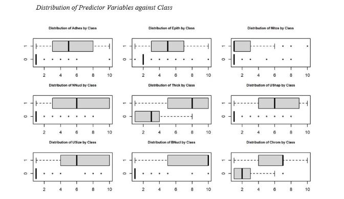
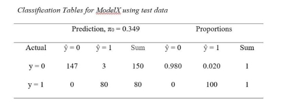
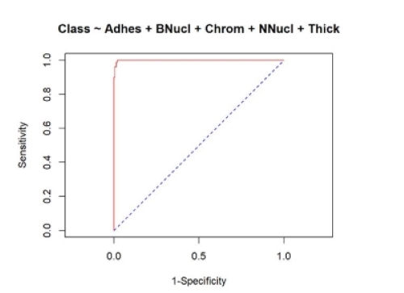

# Breast Cancer Prediction Model

A logistic regression model was created in R to assess the relationship between tumor status (malignant, benign) and nine potential explanatory variables. Steps of this analysis include identifying significant explanatory variables, partitioning data, stepwise procedure for model selection, internal model validation, determining the goodness of fit, assessing predictive power and producing relevant statistics about independent variables. 

Variable selection methods include stepwise backward elimination and forward selection procedures. AIC scores, ROC curvature, AUC values and predictive power of the models were considered in model selection. Residual analysis was used to determine the fit of candidate models using the Hosmer-Lemeshow test. Sensitivity, specificity and accuracy were calculated using various cutoff values. 

The final model, ModelX, includes five predictor variables (Adhes + BNucl + Chrom + NNucl + Thick). Hosmer-Lemeshow test produced a large p-value (X2 = 3.0173, df = 8, p = 0.9333) indicating a strong measure of goodness of fit. ModelX has AIC score of 80.05, the lowest of all models. ModelX has an accuracy of 98.70%, sensitivity of 100% and specificity of 98.0%, using the testing data with a cutoff of π0 = 0.349 (the proportion of malignant tumors in the entire sample). 

Receiving operating characteristic (ROC) curve was constructed for this model using the test data set. Area under the ROC curve (AUC) value is 0.999, indicating  high accuracy model predictions.

Source:

This dataset was created by Dr. William H. Wolberg (physician)
University of Wisconsin Hospitals
Madison, Wisconsin, USA

https://archive.ics.uci.edu/ml/datasets/breast+cancer+wisconsin+%28original%29

Citations:

1. L. Mangasarian and W. H. Wolberg: "Cancer diagnosis via linear programming", SIAM News, Volume 23, Number 5, September 1990, pp 1 & 18.

2. William H. Wolberg and O.L. Mangasarian: "Multisurface method of pattern separation for medical diagnosis applied to breast cytology", Proceedings of the National Academy of Sciences, U.S.A., Volume 87, December 1990, pp 9193-9196.

3. O. L. Mangasarian, R. Setiono, and W.H. Wolberg: "Pattern recognition via linear programming: Theory and application to medical diagnosis", in: "Large-scale numerical optimization", Thomas F. Coleman and Yuying Li, editors, SIAM Publications, Philadelphia 1990, pp 22-30.

4. K. P. Bennett & O. L. Mangasarian: "Robust linear programming discrimination of two linearly inseparable sets", Optimization Methods and Software 1, 1992, 23-34 (Gordon & Breach Science Publishers).
