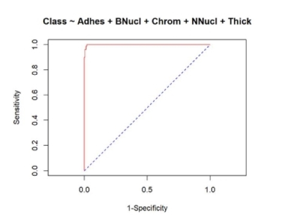
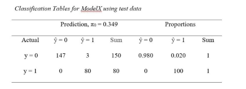
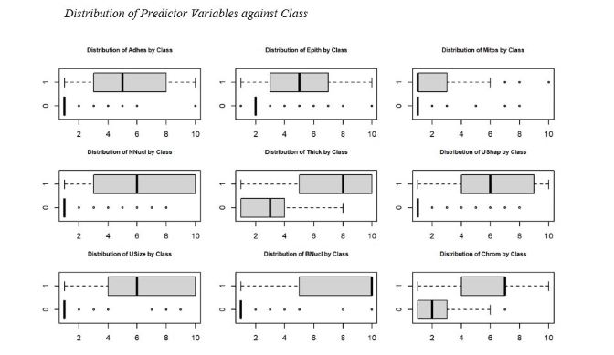

# Tumor Classification Model

A logistic regression model that predicts whether a tumor is malignant or benign using patient biomarker data. Built on the Wisconsin Breast Cancer dataset (699 records, 9 features). Achieves 98% accuracy and 0.999 AUC.

## Goal

Classify tumors from cell sample measurements alone, without invasive procedures — and identify which biomarkers are most predictive.

## What it covers

- Exploratory data analysis and correlation analysis
- Variable selection via stepwise forward and backward elimination
- Logistic regression model fitting and validation
- Goodness of fit (Hosmer-Lemeshow test)
- ROC curve, AUC, sensitivity, and specificity analysis

## Results

| Metric | Value |
|---|---|
| Accuracy | 98% |
| Sensitivity | 100% |
| Specificity | 98% |
| AUC | 0.999 |
| AIC | 80.05 |

**Final model predictors:** Adhesion, Bare Nuclei, Chromatin, Normal Nucleoli, Clump Thickness

The Hosmer-Lemeshow test confirmed strong fit (p = 0.9333).

## Stack

R — logistic regression, stepwise selection, ROC analysis

## Run it

Requires R and RStudio. Open the file in `R Code/` and run.

Data source: [UCI Wisconsin Breast Cancer Dataset](https://archive.ics.uci.edu/ml/datasets/breast+cancer+wisconsin+%28original%29)

## Visualizations

